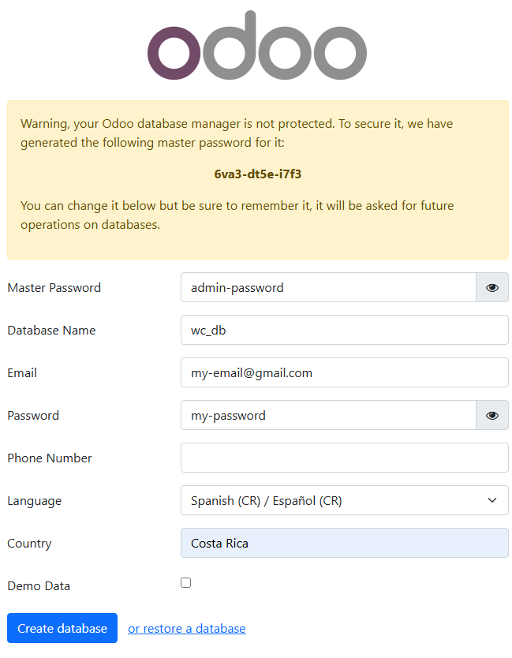
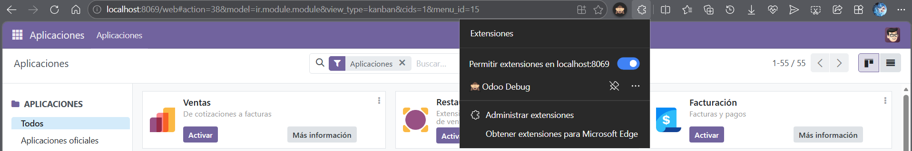
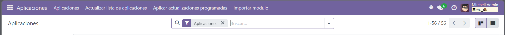
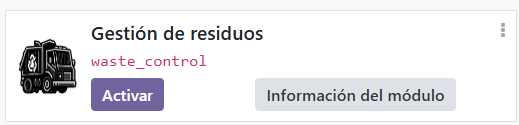
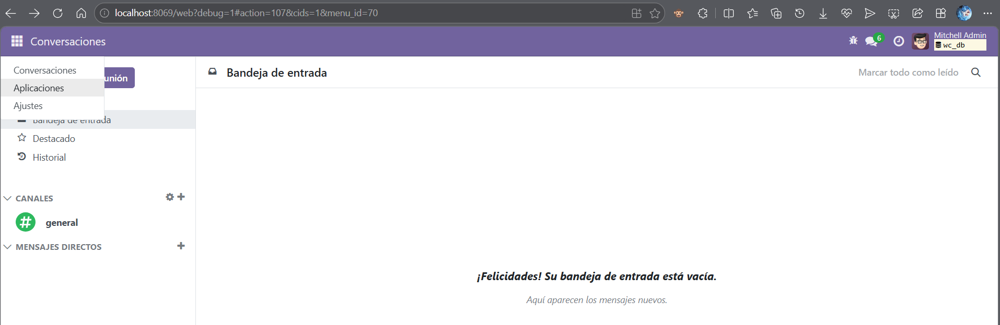
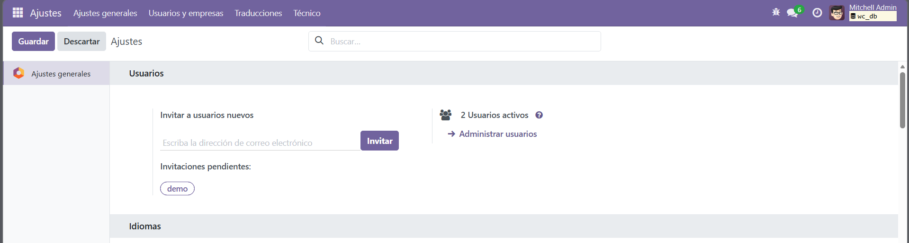
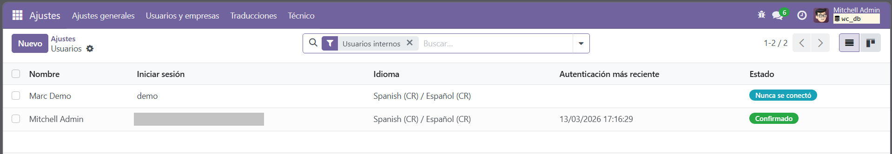
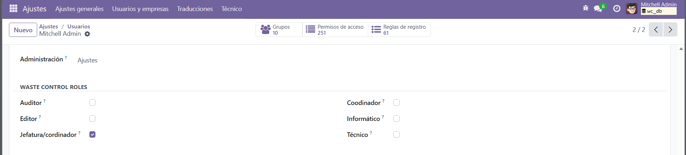
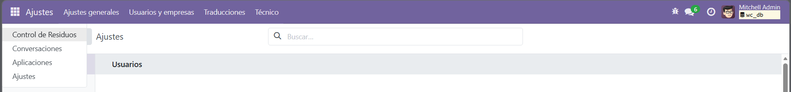
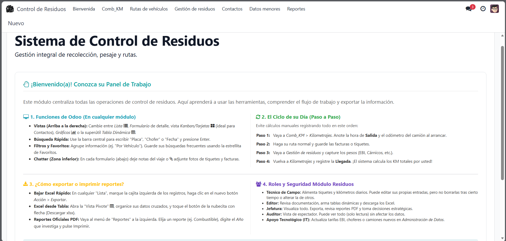

# Iniciar en Odoo

## Pasos a seguir

1. Ingresar a <http://localhost:8069/>
2. Para configura rellena los datos iniciales:

    

    Rellanar los datos con los datos propios.
    Definir correctamente el idioma y país.

    Para iniciar con datos de prueba marcar `Demo Data`.

3. Presiona crear y espera.
4. En login ingresa la información ingresada el `correo` y `contraseña`.

    Para ingresar a opciones de desarrollador instalar lo siguiente en el navegador

    

    Una ves instalado presiona y espera a que recargue la pagina quedando asi:

    

5. Presiona actualizar lista de aplicaciones, cuando termina busca:

    

6. Una vez activada ingresa a `ajustes`

    

7. Ajustes -> Administración de usuarios -> Usuario con el que se ingreso (por defecto Mitchell Admin)

    

    

8. Selecciona uno de los roles para el usuario, guarda y recarga la pagina (puede elegir varios roles a la vez)

    

    Solo se mostrara la elección de roles con el modo de desarrollador activado (Lo que se activo con la extension).

    Una vez seleccionado los roles puede perchonar la extensión para desactivar el modo de desarrollado y ver las vistas como un usuario normal.

9. Ingresa al modulo

    

10. Explorar

    

    El modulo se divide en secciones principales:

    - Comb-km
    - Rutas de vehículos
    - Gestion de residuos
    - Contactos (personas y grupos)
    - Datos menores (parametros o registros)
    - Reportes (generacion de reportes específicos)

## Resumen

Para usar el modulo consiste en rellenar formularios.
Cada formulario puede llevarlo a rellenar un dato de otro formulario para editar o crear un registro existente.
Para algunos de los campos basta con seleccionar registro existentes.
Los registros y reportes se clasifican por año.
